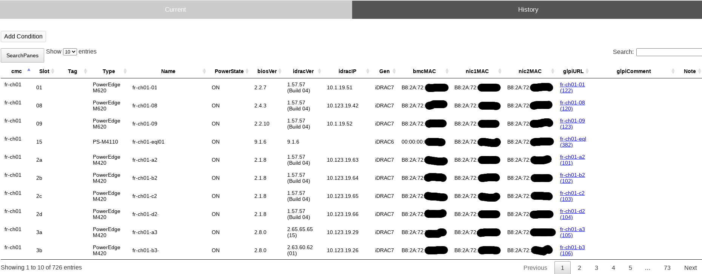
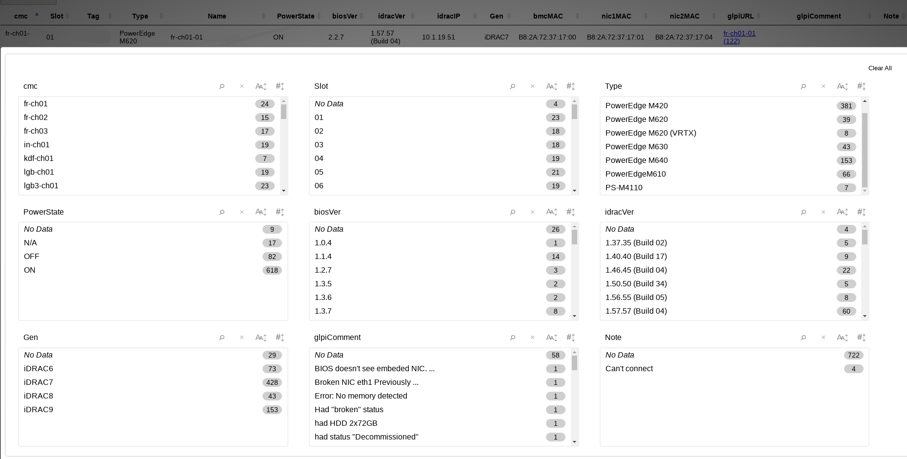
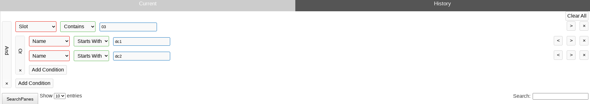
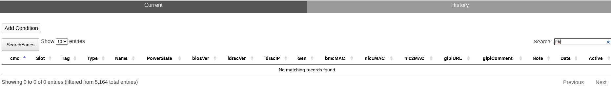

# Blades inventory for Dell M1000E and VRTX chassis

Gets data from chassis and stores it in sqlite database. 
(Currently list of chassis obtains dynamicalli from zabbix by hostgroup).

Data could be visible and filtered / searched via web interface.

Required:
1. linux web server with php support  
2. php
3. python3
4. sqlite3
5. js [code.jquery.com](https://code.jquery.com) (see [install.txt](install.txt))   
6. datatables from [cdn.datatables.net](https://cdn.datatables.net) (see [install.txt](install.txt))

Common view current info  

Common filter  

Custom select filter  

View history  

